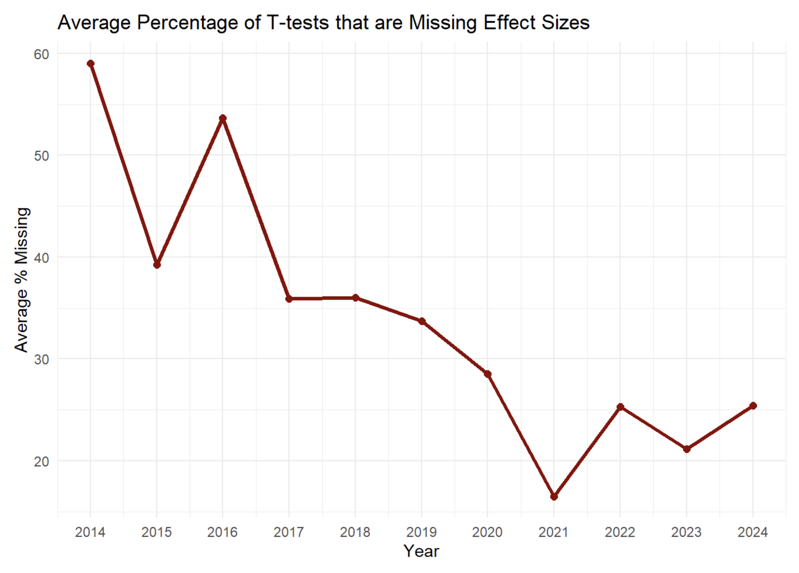

```{r load functions}
#| include: false

library(papercheck)
library(tidyverse)
```

JARS (journal article reporting standards), by the American Psychological Association offer guidance on the information that should be reported in scientific articles to enhance their scientific rigour [@appelbaum_journal_2018]. The guidelines for quantitative research are a set of excellent recommendations, and almost every published scientific article would be improved if researchers actually followed JARS.

However, as the guidelines are not well known, authors usually do not implement them, and reviewers do not check if journal article reporting standards are followed. Furthermore, there are so many guidelines, it would take a lot of time to check them all manually. Automation can help increase awareness of JARS by systematically checking if recommendations are followed, and if not, point out where improvements can be made. Below we will illustrate how 2 JARS guidelines can be automatically checked. There are dozens of other potential guidelines for which dedicated Papercheck modules could be created. Anyone who has created an R package will have the experience of running R CMD check, which automatically checks dozens of requirements that an R package must adhere to before it is allowed on CRAN. It should be possible to automatically check many of the JARS guidelines in a similar manner.

## Exact p-values

The first reporting guideline we will illustrate is to report exact p-values. The APA Manual states:

> Report exact p values (e.g., p = .031) to two or three decimal places. However, report p values less than .001 as p \< .001.

Reporting *p* values precisely allows readers to include the test results in *p* value meta-analytic tests, such as p-curve, or z-curve [@simonsohn_p-curve_2014; @bartos_zcurve_2020], and makes it possible the check the internal coherence of the reported result with tools such as Statcheck [@nuijten_prevalencestatisticalreporting_2015]. Papercheck has a dedicated module, "exact-p", to identify the presence of imprecise p-values. We can run it on a single paper:

```{r}
#| results: asis

library(papercheck)
res_imprecise <- module_run(psychsci$`0956797617744542`, "exact_p")

res_imprecise

```

The module only returns the exact *p* values, but the Papercheck software has several convenient functions to interact with the information in scientific manuscripts. The `expand_text` function can be used to retrieve text around matches (for example by retrieving the previous and next sentence as well). We can retrieve the full sentence so that users can easily examine whether the reported *p* values should have been precise:

```{r}
res_imprecise_expanded <- expand_text(
  results_table = res_imprecise, 
  paper = psychsci$`0956797617744542`, 
  expand_to = "sentence"
)

unique(res_imprecise_expanded$expanded)
```

Luckily, there are also many papers that follow the JARS guideline and report all *p* values correctly, for example:

```{r}
module_run(psychsci$`0956797616665351`, "exact_p")
```

## Reporting standardized effect sizes

A second JARS guideline that can be automatically checked is whether people report effect sizes alongside their test result. Each test (e.g., a *t*-test, *F*-test, etc.) should include the corresponding effect size (e.g., a Cohen's d, or partial eta-squared). Based on a text search that uses regular expressions (regex), we can identify *t*-tests and *F*-tests that are not followed by an effect size, and warn researchers accordingly.

```{r}
#| results: asis

module_run(
  paper = psychsci$`0956797616657319`,
  module = "effect_size"
)

```

## Checking Multiple Papers

You can also run modules for multiple papers at once and get a summary table.

```{r}
#| results: asis

module_run(psychsci[1:10], "effect_size")
```

This can be useful for meta-scientific research questions, such as whether there is an increase in the best practice to report effect sizes for *t*-tests over time. In the plot below we have run the module on 1838 published articles in the journal Psychological Science between 2014 and 2024. We can see that where a decade ago, close to half the reported t-tests would not be followed by an effect size, but a decade later, this holds for only around 25% of tests. Perhaps the introduction of a tool like Papercheck can reduce this percentage even further (although it does not need to be 0, as we discuss below).

Our main point is to demonstrate that it is relatively easy to answer some meta-scientific questions with Papercheck. Editors could easily replicate the plot below for articles in their own journal, and see which practices they should improve. As we highlighted in the [introductory blog post](https://daniellakens.blogspot.com/2025/06/introducing-papercheck.html), when modules are used for metascience, they need to be validated, and have low error rates. We have manually checked the *t*-tests and *F*-tests in 250 papers in Psychological Science, and our effect_size module detected 100% of *t*-tests with effect sizes, 99% of *t*-tests without effect sizes, 99% of *F*-tests with effect sizes, and 100% of *F*-tests without effect sizes. This is accurate enough for meta-scientific research.

```{r}
#| include: false
#| eval: false

load("psychsciencexml.RData")
load("psych_science_crossref_2014_2025_original.RData")

results <- results %>%
  distinct(url, .keep_all = TRUE)

psych_sci_ttest_effect <- module_run(xml, "effect_size")
tests_summary <- psych_sci_ttest_effect$summary
tests_summary$doi_correct <- paste("10.1177/", sub("\\.xml$", "", tests_summary$id), sep = "")
tests_summary$url <- paste0("https://doi.org/",tests_summary$doi_correct)

# Add crossref information
tests_summary <- dplyr::left_join(tests_summary, results[, c("url", "title", "is.referenced.by.count", "issued", "reference.count")], by = c("url" = "url"))

tests_summary <- tests_summary %>%
  mutate(year = year(parse_date_time(issued, orders = c("ymd", "ym", "y"))))

missing_per_year <- tests_summary %>%
  group_by(year) %>%
  summarise(total_missing = sum(ttests_without_es, na.rm = TRUE))

percentage_missing_per_year <- tests_summary %>%
  mutate(total_tests = ttests_with_es + ttests_without_es,
         percent_missing = ifelse(total_tests > 0, ttests_without_es / total_tests * 100, NA)) %>%
  group_by(year) %>%
  summarise(avg_percent_missing = mean(percent_missing, na.rm = TRUE))

```

```{r}
#| echo: false
#| eval: false

ggplot(percentage_missing_per_year, aes(x = year, y = avg_percent_missing)) +
  geom_line(linewidth = 1.2, color = "darkred") +
  geom_point(size = 2, color = "darkred") +
  scale_x_continuous(breaks = unique(percentage_missing_per_year$year)) +
  labs(title = "Average Percentage of T-tests that are Missing Effect Sizes",
       x = "Year",
       y = "Average % Missing") +
  theme_minimal()

```



## Improving the Modules

These two examples are relatively straightforward examples of text searches that can identify examples where researchers do not follow reporting guidelines. Still, these algorithms can be improved.

For example, the code to detect *p* values would not match p =\< 0.01 due to the = symbol. It might look like a weird way to report a test result, but we have encountered this example. The module to detect effect sizes ollowing t-tests only matches standardized effect sizes, but it is not always necessary to compute a standardized effect size. For example, if a future meta-analysis would be based on raw scores, and means and standard deviations are reported, it might not be needed to report an effect size. Alternatively, we might just accept a tool that has a relatively high Type 1 error rate when checking our manuscript. After all, a spellchecker has a high Type 1 error rate, underlining many names and abbreviations that are correct, but that it does not recognize, and most people use spellcheckers all the time, as any errors they successfully catch make it worthwhile to read over the Type 1 errors and dismiss them. Despite the room for improvement, even these simple text searches can already identify places where published articles could have been improved by adding effect sizes.

There are many more algorithms that can be added to detect other information that should be reported according to the JARS guidelines. If you would like to create and/or validate such a module, do reach out. We are happy to collaborate.

## References

